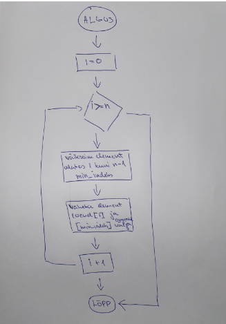
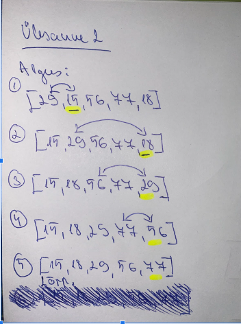

# Ülesanne 2

Joonista plokkskeem, mis esindab Selection Sort algoritmi. Kasutades seda vooluskeemi, demonstreeri sortimisprotsessi loendile: [29, 15, 56, 77, 18]. Tuvasta iga iteratsiooni ajal väikseim element. 

## Lahendus

