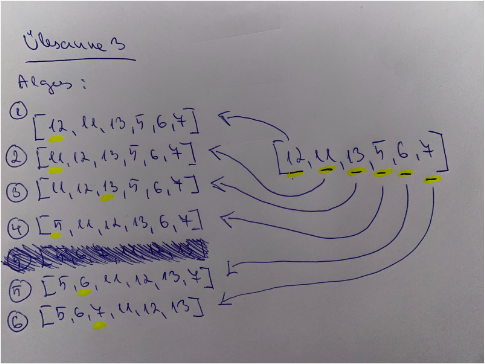

# Ülesanne 3

Antud on osaliselt sorteeritud loend: [12, 11, 13, 5, 6, 7]. Rakenda Insertion Sort algoritmi. Selgita, miks Insertion Sort võib olla tõhusam sellele loendile võrreldes täielikult sortimata loendiga. 

### Lahendus

### Miks Insertion sort võib olla tõhusam sellele loendile võrreldes täielikult sortimata loendiga?

Insertion sort on adaptiivne, mille abil väldib ta üleliigseid liigutusi sorteerimisel.

